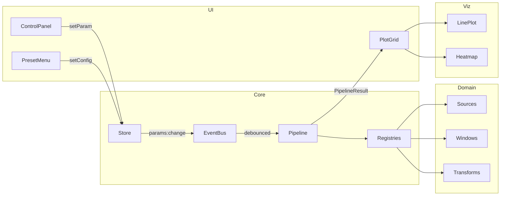

# 🏗 Architecture

Signal Playground is structured around three deliberately small abstractions that let new
features (a new transform, a new signal source, a new visualizer) plug in **without touching
the main app code**.

## The Three Pillars

```
┌───────────────────────────────────────────────────────────────┐
│                       Registry (core)                         │
│  sourceRegistry · transformRegistry · windowRegistry ·        │
│  visualizerRegistry · presetRegistry                          │
└───────────────────────────────────────────────────────────────┘
            ▲                ▲                  ▲
            │ register       │ register         │ register
            │                │                  │
   IDataSource       ITransform         IVisualizer / IWindow
            │                │                  │
            └────► Pipeline.run() ◄──────┐      │
                       │                 │      │
                       ▼                 │      │
                 PipelineResult ─────────┴──────┘
                       │
                       ▼
                  PlotGrid (UI)
```

## Data Flow



## Key Abstractions

### 1. `DataBuffer` / `ComplexBuffer`

Dimension-agnostic data containers. Same type carries **1D signals**, **2D images** and
**3D volumes** — only `shape` differs.

### 2. `IDataSource`

Anything that produces a `DataBuffer` from a parameter set. Sine wave, image upload,
microphone input — all the same interface.

### 3. `ITransform`

A pure function from `DataBuffer` to `DataBuffer | ComplexBuffer`. Declares its input/output
**domain**, **dimensions**, and parameter **schema**. The UI auto-generates a control panel
from the schema.

### 4. `IVisualizer`

Knows how to render a buffer of a given shape. `PlotGrid` picks visualizers based on the
transform's output (complex → magnitude+phase plots; spectral 2D → heatmap; etc.).

### 5. `Registry<T>` & `Pipeline`

The registry is the only thing main app code talks to. Pipeline is a tiny orchestrator
that walks `Source → Window → Transform`, returning timing data for the status bar.

## Why this design?

| Goal | Mechanism |
|------|-----------|
| Add **DCT** without touching UI | Schema-driven `ParameterForm` + Registry |
| Reuse 1D code for 2D images later | `shape: number[]` everywhere, no `length` |
| Keep main loop ≤ 100 LOC | Pipeline pulls from registries, not hardcoded modules |
| Allow heavy compute in workers later | Buffers are `Float32Array` (Transferable) |

## Source Map

```
src/
├── core/              # 100% domain-free abstractions
├── domains/
│   ├── shared/        # Algorithms used by multiple domains (FFT core, complex)
│   ├── signal/        # 1D signal domain (current)
│   └── image/         # 2D image domain (v0.3)
├── visualizers/       # Plotly-based renderers
├── ui/                # DOM components
└── utils/             # Tiny helpers
```
